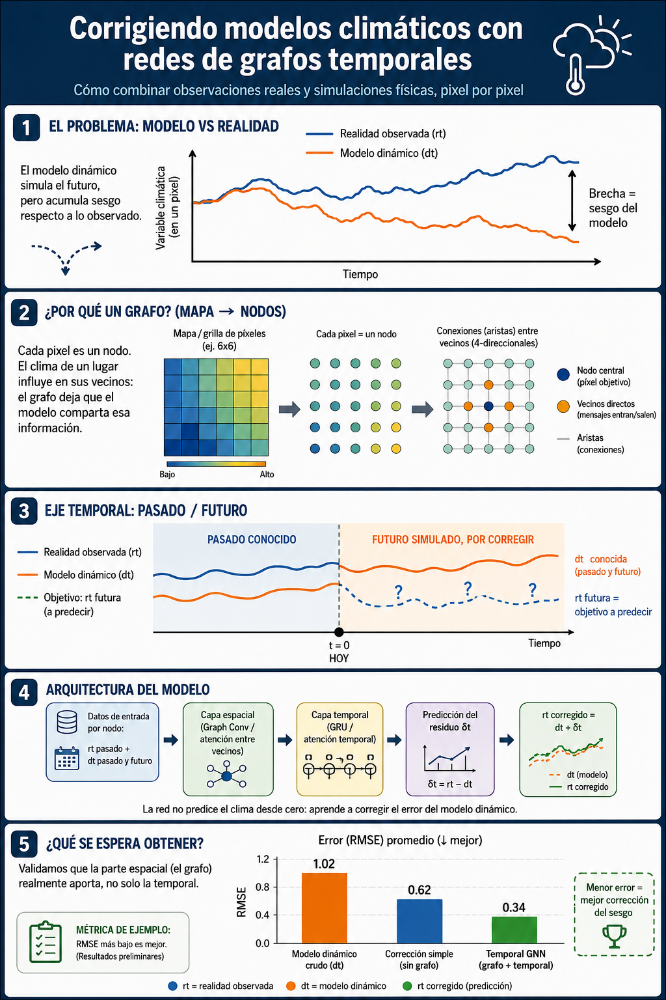

# Revisión de literatura: Temporal GNNs para corrección de sesgo de modelos climáticos dinámicos

**Fecha:** Junio 2026
**Tema:** Uso de redes neuronales de grafos temporales (Temporal GNN) para corregir series de tiempo de un modelo dinámico climático a nivel de pixel, usando como referencia datos reales observados.

---

## 1. Resumen ejecutivo

El problema planteado —corregir una serie temporal simulada por un modelo dinámico (`dt`) usando una serie temporal observada (`rt`), en un dominio espacial tipo grilla de pixeles— corresponde a una familia bien establecida en meteorología/climatología llamada **post-processing** o **bias correction (BC)**, y NO a un problema de forecasting puro: el modelo dinámico ya "conoce" el futuro porque es una simulación física, así que sus valores futuros (`dt_1...dt_T`) pueden usarse legítimamente como covariables de entrada.

La novedad de tu proyecto está en combinar dos líneas que normalmente se tratan por separado:

1. **Bias correction con deep learning** (históricamente CNN, U-Net, ConvLSTM, ANN simples).
2. **GNN espacio-temporales** (originadas en forecasting de tráfico y adaptadas recientemente a meteorología), que permiten compartir información entre pixeles vecinos de forma aprendida en lugar de asumir independencia espacial.

No se encontró literatura que combine explícitamente *temporal GNN + bias correction de modelo dinámico a nivel de pixel con grafo de grilla completa*, lo cual es una señal de que el proyecto tiene una contribución razonable, aunque construida sobre piezas ya validadas individualmente.

---

## 2. Marco conceptual del problema

| Elemento | Tu notación | Rol |
|---|---|---|
| Serie observada pasada | `rt_0, rt_-1, ..., rt_-k` | Target histórico / ancla de verdad |
| Serie del modelo, pasada y futura | `dt_-k, ..., dt_0, ..., dt_T` | Covariable conocida en todo el horizonte |
| Objetivo a predecir | `rt_1, ..., rt_T` | Corrección esperada del modelo dinámico |

Esto es estructuralmente idéntico al **Model Output Statistics (MOS)** clásico, extendido con:
- Componente **espacial** (pixeles relacionados entre sí → grafo).
- Componente **temporal** (ventanas de historia y horizonte → secuencia).

---

## 3. Líneas de trabajo relevantes

### 3.1 Bias correction de modelos climáticos con deep learning (sin GNN)

- **Bustillo et al. / ANN feedforward de 3 capas (J. Hydrometeorology, 2017):** corrige temperatura y precipitación de CCSM3 sobre Sudamérica usando como inputs la propia variable en rezagos (lag 0,1,2,3) más desviación estándar en una vecindad 3×3. Es el antecedente más directo de "usar vecinos espaciales" aunque sin grafo explícito — usa una ventana fija en vez de un grafo aprendido.
- **U-Net / ConvLSTM para corrección de SST (2025):** comparan ANN, ConvLSTM y U-Net para corregir proyecciones de un GCM; U-Net resultó el único que capturó bien tanto variabilidad espacial como temporal, superando en ~15% el RMSE de métodos estadísticos clásicos (EDCDF). Conclusión relevante: los métodos puramente temporales (LSTM) no bastan cuando el sesgo tiene estructura espacial fuerte — refuerza la necesidad de un componente espacial explícito como el que tú planteas con la GNN.
- **DeepONet para corrección de "nudging tendency" (E3SMv2, 2023):** en vez de predecir el estado corregido directamente, aprende el operador que mapea el estado pre-corrección a la *tendencia de corrección* (delta), combinado con un autoencoder convolucional para reducir dimensionalidad. Es el antecedente más fuerte de la recomendación de **aprender el residuo en vez del valor absoluto**.
- **Corrección temporal vía modelos de atención (2024):** señala una limitación importante de los métodos de BC clásicos: ignoran la dependencia entre instantes consecutivos, por lo que fallan en reproducir estadísticas de largo alcance (ej. duración de olas de calor). Usan modelos de atención probabilísticos para modelar la dependencia temporal explícitamente. Relevante para decidir si usar atención temporal (Transformer) en vez de, o además de, GRU/LSTM dentro de tu bloque temporal.

### 3.2 GNN para post-processing meteorológico (antecedente más cercano a tu propuesta)

- **GNN con atención espacial para post-processing de ensembles (Feik, Lerch & Stühmer, 2024):** estaciones meteorológicas como nodos de un grafo; usan atención para decidir qué vecinos son informativos para corregir el pronóstico de temperatura a 2m sobre Europa. Mejora sustancial sobre redes neuronales station-based que tratan cada ubicación de forma independiente. Es la prueba de concepto más directa de que "GNN + post-processing meteorológico" funciona mejor que ignorar la estructura espacial.
- **GNN multimodal para forecasting localizado off-grid (2024):** corrige el forecast gridded de un modelo (ERA5) usando observaciones históricas locales de estaciones, modelando cada fuente de datos (observación vs. modelo) como un *tipo de nodo distinto* dentro del mismo grafo heterogéneo. Esto es un patrón de diseño directamente aplicable: en vez de concatenar `rt` y `dt` como features de un mismo nodo, podrías modelarlos como dos tipos de nodo conectados (grafo heterogéneo), lo cual permite que la red aprenda relaciones distintas para cada fuente.
- **STCNet (Frontiers, 2022):** fusiona explícitamente datos de estación (histórico, observado, una sola ubicación) con datos de grilla del NWP (futuro, múltiples puntos), usando convoluciones 2D para lo espacial y 1D para lo temporal en vez de RNN, argumentando que evita el problema de acumulación de error y gradientes inestables de las RNN. No usa grafos (usa CNN sobre grilla regular), pero el patrón de fusión observación+modelo es exactamente el tuyo.

### 3.3 Arquitecturas base de GNN espacio-temporales (transferibles desde tráfico/sensores)

Tu escenario (pixeles fijos en una grilla, cada uno con una serie temporal) es estructuralmente idéntico al de **forecasting de tráfico en redes de sensores**, donde ya existen arquitecturas maduras y bien probadas:

| Arquitectura | Idea clave | Por qué te sirve |
|---|---|---|
| **DCRNN** (Diffusion Convolutional RNN) | Convolución de difusión sobre el grafo + GRU para lo temporal | Buen baseline clásico, requiere grafo fijo conocido |
| **Graph WaveNet** | Convoluciones temporales (TCN) + **matriz de adyacencia aprendida** (adaptativa) | Útil si no confías en que la adyacencia geográfica es la "correcta" (ej. teleconexiones atmosféricas) |
| **MTGNN** | Aprende el grafo y captura dependencias entre variables múltiples simultáneamente | Útil si luego agregas más de una variable climática por pixel |
| **A3T-GCN** | GCN + GRU + mecanismo de atención temporal | Buen punto medio en complejidad |

Un review reciente de GNN para datos espacio-temporales (Li & Yu, 2023) documenta explícitamente el caso de **cada celda de una grilla climática tratada como nodo**, con conectividad esparsa aprendida automáticamente para detectar teleconexiones (ej. en pronóstico estacional de temperatura superficial del mar) — soporta usar adyacencia aprendida en vez de solo geográfica si el fenómeno climático lo justifica.

---

## 4. Brecha y oportunidad de tu proyecto

No se encontró un trabajo que junte:
- Grafo de **pixeles completos de una grilla** (no solo estaciones dispersas),
- Corrección de un **modelo dinámico físico** (no solo un ensemble de NWP estadístico),
- Uso explícito de **covariables futuras conocidas del modelo** dentro de una **Temporal GNN** con aprendizaje de adyacencia.

Esto posiciona tu proyecto como una combinación razonable y defendible de líneas ya validadas por separado — apto tanto para un proyecto educativo serio como, con más desarrollo, para una contribución metodológica menor publicable.

---

## 5. Recomendaciones de diseño derivadas de la revisión

1. **Aprender el residuo** `δt = rt − dt`, no `rt` directamente (DeepONet, nudging tendency).
2. **Split temporal estricto** (no aleatorio) para evitar fuga de información autocorrelacionada.
3. **Adyacencia aprendida o híbrida** (geográfica + aprendida), no solo grilla fija, si esperas teleconexiones.
4. Considerar **grafo heterogéneo** con nodos tipo "observación" y tipo "modelo" si el desempeño con concatenación simple de features no es suficiente.
5. Si el sesgo tiene componentes de largo alcance temporal (ej. duración de eventos extremos), agregar un módulo de **atención temporal**, no solo GRU.
6. Comparar siempre contra baselines simples: el `dt` crudo sin corregir, y un MOS/ANN sin componente de grafo — para cuantificar cuánto aporta específicamente la parte espacial.

---

## 6. Referencias

1. Bustillo, V. et al. (2017). *Bias Correction of Climate Modeled Temperature and Precipitation Using Artificial Neural Networks.* Journal of Hydrometeorology, 18(7).
2. (2025). *Global Climate Model Bias Correction Using Deep Learning.* arXiv:2504.19145 / IOPscience.
3. (2024). *A Temporal Bias Correction using a Machine Learning Attention model.* arXiv:2402.14169.
4. (2023). *Learning bias corrections for climate models using deep neural operators.* arXiv:2302.03173.
5. Feik, M., Lerch, S., Stühmer, J. (2024). *Graph Neural Networks and Spatial Information Learning for Post-Processing Ensemble Weather Forecasts.* arXiv:2407.11050.
6. (2024). *Multi-modal graph neural networks for localized off-grid weather forecasting.* arXiv:2410.12938.
7. (2022). *Spatiotemporal forecasting model based on hybrid convolution for local weather prediction post-processing (STCNet).* Frontiers in Earth Science.
8. Li, Y., Yu, R. et al. (2023). *Graph Neural Network for spatiotemporal data: methods and applications.* arXiv:2306.00012.
9. Cui, Z., Henrickson, K., Ke, R., Wang, Y. (2019). *Traffic graph convolutional recurrent neural network.* IEEE Trans. Intelligent Transportation Systems.
